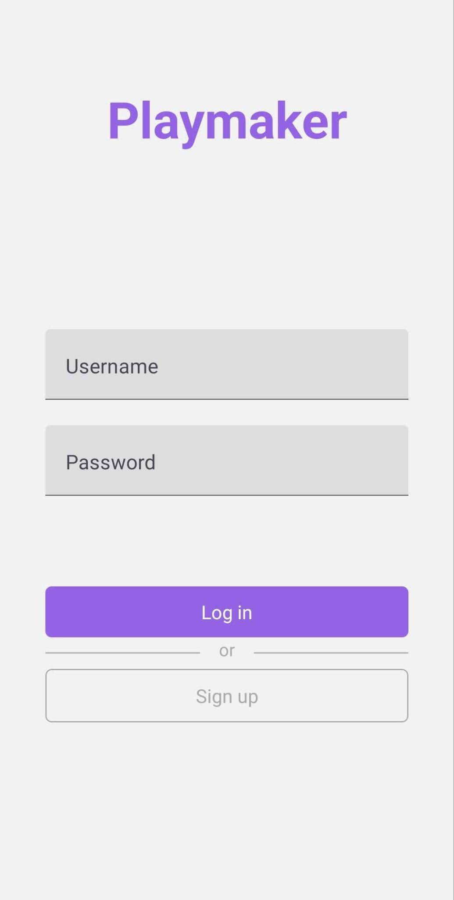
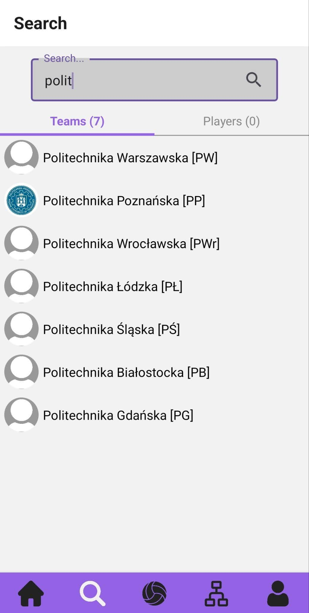
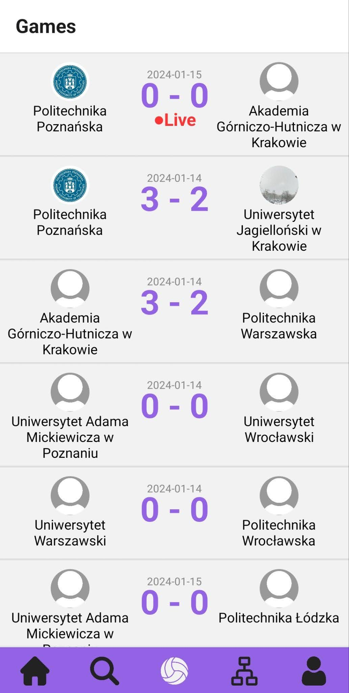
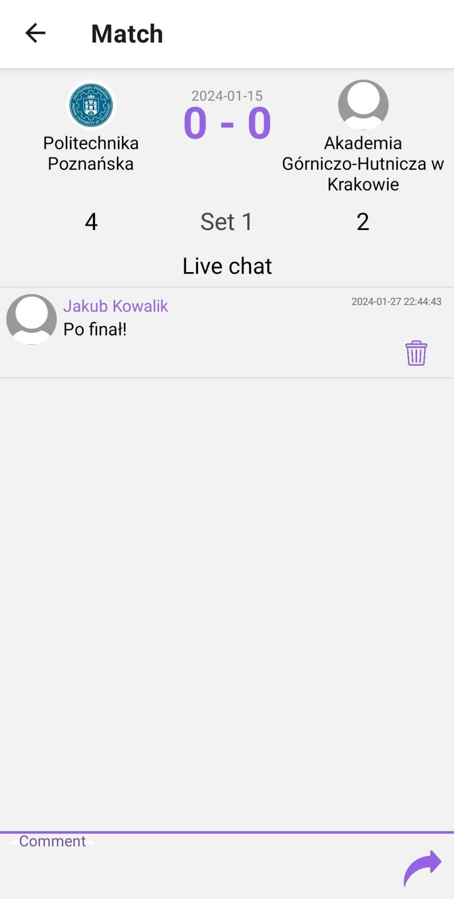
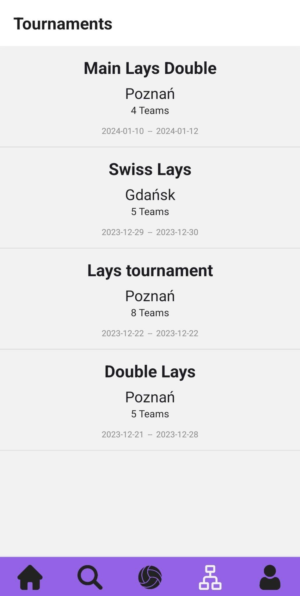
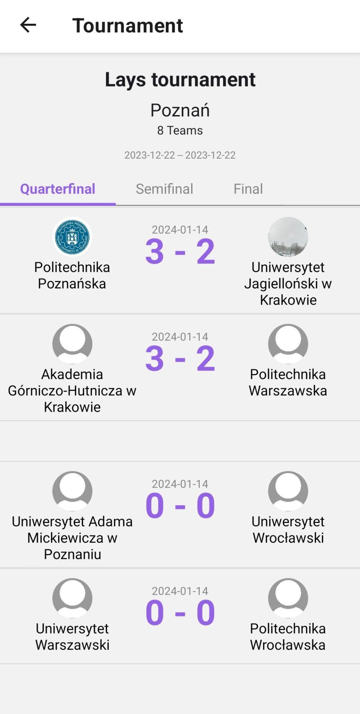
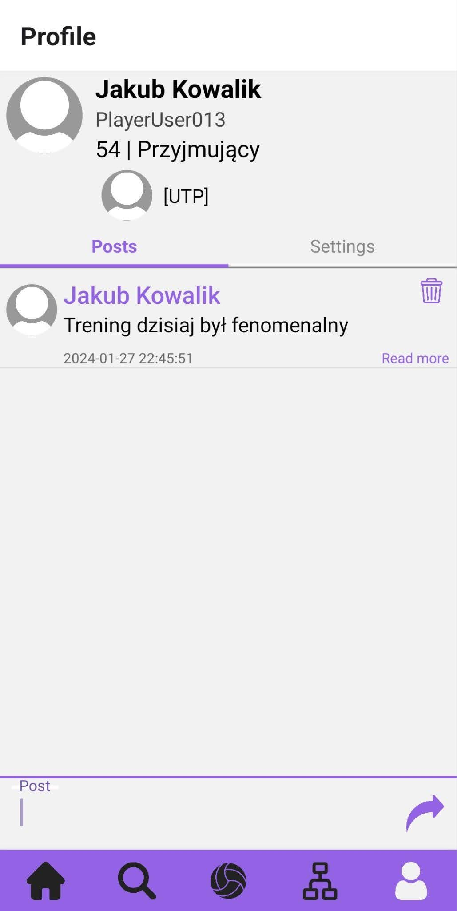

# Praca inżynierska - aplikacja mobina dla kibiców, sędziów i zawodników

Aplikacja mobilna jest jedną z części pracy inżynierskiej i została napisana z wykorzystaniem ReactNative.

# Wygnąd programu
### Ekran logowania

### Ekran do wyszukiwania zespołów i graczy
 

### Ekran z listą gier

### Ekran meczu

### Ekran z listą turniejów

### Ekran ze szczegółami turnieju

### Ekran z profilem zawodnika
